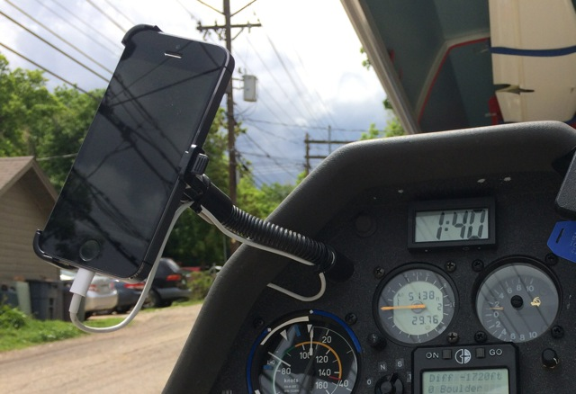

# GlideTrack Mobile Tracker

GlideTrack mobile tracking app works in conjunction with the GlidePort.aero
track visualization and analysis web app.  It sends realtime high-resolution
tracking data to the ground.  It also allows you to send text messages that
can be seen in GlidePort.aero.

This is a reference implementation.  It is intended to be an example app
illustrating how to use the GlidePort.aero API.  However, GlideTrack is fully
functional, you can use it to track your flights in realtime.

## Setup

Make sure that you have a GlidePort.aero user account.  To create a user account
go to [GlidPort.aero](http://glideport.aero) and register.  When you submit your
registration information you will receive an activation email.  Click the link
in the email to complete the registration process.  If you don't receive the
registration email, check your spam folder.

Once you have your GlidePort.aero account, run GlideTrack on your mobile phone,
enter your GlidePort login name, and click save.  If needed, update the glider
information that will be associated with this tracker.

## Tracking

If you need to update your glider information, touch "Settings" prior to your
flight.  Alternatively, you can edit your track in GlidePort.aero after the
flight.

When you touch "START" to start tracking, GlideTrack uses the phone GPS to
record your track and to periodically send it to GlidePort.aero.  If there is no
cellular phone connectivity, it will keep retrying until it is able to
successfully send data.  If you stop tracking and start again within 15 minutes,
the old track will be continued.

To send a message, enter your message and touch "Send".  To resend a recent
message, touch the message so that it appears in the message box, and touch
"Send".  Note: messages can only be sent when tracking is ON.

Touch "STOP" when back on the ground.

### Tips and Tricks

  * It is recommended to run the app and start tracking a few minutes before you
    fly.  That way the GPS will have time to get a good position lock.
  * It is important that your phone has a good view of the sky in order to get a
    good quality track.  For example, if you keep the phone in your pocket, you
    will not get a good quality track.
  * GlideTrack is not optimized for battery life.  It is recommended that you
    plug it into an external battery if you plan to do long flights.  E.g., you
    can buy cheap 12V-to-USB adapters and phone cradles on eBay.

Here is what my setup looks like -- the phone is plugged into the main battery
and has a good view of the sky.  
  
iPhone mount and power cord.  
  
Side view.  The USB power adapter is visible in the bottom left.

## Development

The GlidePort.aero API is open!  Any gliding software can use the API to send
high-resolution track data to GlidePort.aero so that spectators can follow
flights in near-realtime.

The GlidePort hi-res track API is described in [API.md](API.md). The heart of
the api is the `gt` call.  It is designed to be as minimal and as simple as
possible.  You essentially pass IGC data (fragment) in the body of an http POST
request.  See Track.js for how it is used.

GlideTrack is implemented in HTML5/JavaScript for simplicity.  It can be
built into a native app using Cordova/PhoneGap.  The API can of course be
used from any language.

__NOTE__: GlideTrack currently only keeps tracks in memory, it does not save
them.  In other words, if you kill the app or if the app crashes all tracking
that has yet not been sent will be lost.

### Defines

There are a lot of defines in Manager.js, Settings.js, and Track.js.  The
important development mode defines are:

  * `DBGINFO` in Track.js: Switch to true to include transfer info in the track.
    This is useful for analyzing mobile coverage in your flight area.
  * `LOG_ALL` in Manager.js: Switch to true to send raw GPS fixes to the ground.
    The default is to send fixes at 4s interval.
  * `API_URL` in Settings.js: Change to `http://test.glideport.aero/api` for
    development.
  * In Manager.js init() method, uncomment line `this.geoloc=(new gt.Sim)....`
    to feed in simulated flight track locations instead of using the phone GPS.

__Important__: These four values should be switched to default for deployment.

---
Copyright (c) 2014 TipTop Software, Inc., All Rights Reserved.

